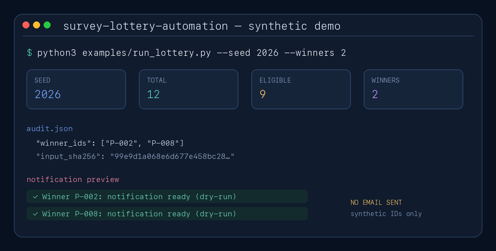
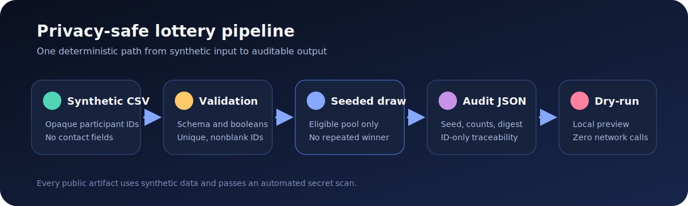

# Survey Lottery Automation

[](https://www.python.org/)
[](#testing)
[](PRIVACY.md)
[](https://colab.research.google.com/github/Hunter20041004/survey-lottery-automation/blob/main/notebooks/Survey_Lottery_Automation.ipynb)

A privacy-safe reconstruction of a real automation workflow built to process **1,000+ survey responses**. It turns an error-prone operational task into a reproducible pipeline with strict validation, auditable selection, and safe notification previews.



## Why this project exists

Manually reviewing a large survey response sheet and notifying selected participants does not scale well. The original Google Colab script connected Google Sheets to Gmail and applied a fixed serial-number suffix rule for a campaign.

This public portfolio version preserves the real problem while improving the engineering:

- separates input, validation, selection, audit, and notification concerns;
- demonstrates seeded random selection without misrepresenting the original rule;
- rejects malformed rows, duplicate IDs, and invalid draw sizes;
- records a privacy-safe audit trail for reproducibility;
- defaults to local dry-run previews and performs no network sending;
- uses synthetic IDs only and includes automated secret regression checks.

## Workflow



```text
Synthetic CSV
    → strict validation
    → eligible participant pool
    → seeded, non-repeating draw
    → privacy-safe JSON audit
    → local notification preview
```

## Engineering decisions

| Concern | Original operational notebook | Public portfolio version |
| --- | --- | --- |
| Selection | Fixed serial-number suffix rule | Seeded random sample, reproducible by seed |
| Structure | One Colab cell mixed data, rules, and email | Small dependency-free Python modules |
| Credentials | Embedded directly in the notebook | No credentials; private deployments use secret storage |
| Data | Live survey contacts | Synthetic opaque participant IDs |
| Notification | Direct SMTP delivery | Dry-run preview only |
| Verification | Manual execution | Unit, CSV contract, subprocess, notebook, and secret-scan tests |

## Quick start

Requires Python 3.11 or newer.

```bash
git clone https://github.com/Hunter20041004/survey-lottery-automation.git
cd survey-lottery-automation
python3 -m venv .venv
source .venv/bin/activate
python3 -m pip install -e .
python3 examples/run_lottery.py --seed 2026 --winners 2
```

The first output line is a JSON audit record. Subsequent lines are local notification previews marked `dry-run`.

## Data contract

The public CSV accepts exactly two required fields:

| Field | Meaning | Example |
| --- | --- | --- |
| `participant_id` | Unique opaque identifier | `P-001` |
| `eligible` | Case-insensitive `true` or `false` | `true` |

No contact field is part of the public contract. A private deployment can map selected IDs back to contact details outside this repository.

## Audit record

Each draw records:

- UTC timestamp;
- caller-supplied seed;
- requested winner count;
- total and eligible population counts;
- selected synthetic IDs;
- SHA-256 digest of the ordered input IDs.

The audit record never includes names, email addresses, student IDs, spreadsheet URLs, credentials, or message bodies.

## Testing

```bash
PYTHONPATH=src python3 -m unittest discover -s tests -v
```

The suite exercises business rules and real boundaries: temporary CSV files, a subprocess CLI workflow, notebook JSON, and tracked-file secret scanning. It does not rely on mocked Google or SMTP responses.

## Repository structure

```text
data/                   Synthetic sample responses
examples/               Runnable command-line workflow
notebooks/              Google Colab walkthrough
src/survey_lottery/     Tested application modules
tests/                  Unit, contract, and safety tests
PRIVACY.md              Public/private data boundary
```

## Limitations

- The public demo does not connect to a live Google Sheet.
- It does not send email or map IDs to real contact information.
- A seed makes a draw reproducible, not unpredictable; use an independently generated and recorded seed when procedural fairness requires one.

## 中文摘要

這個專案源自一個真實的問卷活動：超過 1,000 筆回覆若逐筆人工處理與通知，容易耗時並出錯。公開版保留問題背景，但全面改用合成資料，加入輸入驗證、可重現抽獎、稽核紀錄、dry-run 通知與安全測試；不公開任何參與者個資或憑證。

## License

[MIT](LICENSE)
